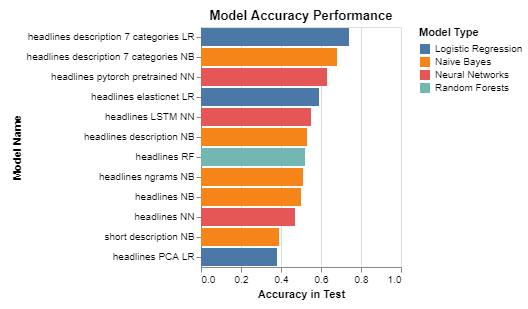

# HuffPost Dataset

This is a Data Science project for Exploratory Data Analysis and Machine Learning modeling with a the Huffpost dataset using Python. 

The data can be found in the following link ([link to Dataset](https://www.kaggle.com/rmisra/news-category-dataset)). The dataset contains headlines, short descriptions, authors and category of around 200k articles from the huffPost from 2012 to 2018.

If you want to reproduce the code in this repository, please download and extract json in the following path "./Data/News_Category_Dataset_v2.json" before running the notebooks (NOTE: Given the size of the datasets, some models take long times to complete).

The programming language used is Python with [Altair](https://altair-viz.github.io/) visualization tool on Jupyter Notebooks. Since almost all Altair plots are interactive and Github does not render Altair plots correctly, I recommend that the html file is downloaded and rendered in a browsers, such as Chrome or Firefox, so that you are able to interact with the plots (Github only renders plain Matplotlib plots). For this reason, each jupyter file has a html file with the same name. 

One of this Altair plot is one a made for exploring the Neural Network accuracy for a  high-dimensional grid search (You can find the interactive version of the following plot in the HTML file).

What is interesting about this interactive plots with Altair is that it allows you to select a rectangular area in one of the plots and being able to see the position of the enclosed points in other dimensions of the parameter space. For example, in the first plot to the left, the best performance runs and its running times are selected, while in the other 2 plots to the right one can see another 4 parameter dimensions of the same runs. With this tool is easy to see that the best performance runs are those with a trainning with a number of epochs higher than 15, a learning rate between (2e-5, 3.5e-3) and a dropdown close to 0.5 independent of the batch_size.

## Contents

Here is the list of files and their descriptions:

### Machine Learning Models

Machine Learning models for classifying a "headline" or "headline + short description" as one of the 41 categories (or 7 categories simplified version). Here is the jupyter notebook [News_Headlines_to_Category_Model.ipynb](https://github.com/sotomsa/HuffPostDataSet/blob/main/News_Headlines_to_Category_Model.ipynb) and here is the html file (News_Headlines_to_Category_Model.html)[https://github.com/sotomsa/HuffPostDataSet/blob/main/News_Headlines_to_Category_Model.html]. Some of the highlights included in this jupyter notebook include:

- Models such as Naive Bayes (NB), Logistic Regresion (LR) with/without PCA , Random Forests (RF) and Neural Networks (NN) using SKLearn and Keras.
- Grid Search (sklearn) and Bayesian Optimization (skopt) for hyperparameter search.
- Advanced interactive plots with Declarative Visualization using Altair.
- Conclusions section with some high-level comparison among the models.

    

    |    | model_name                            |   train_accuracy |   test_accuracy |
    |---:|:--------------------------------------|-----------------:|----------------:|
    |  0 | headlines_description_7_categories_LR |             0.69 |            0.74 |
    |  1 | headlines_description_7_categories_NB |             0.65 |            0.68 |
    |  3 | headlines_elasticnet_LR               |             0.59 |            0.59 |
    |  4 | headlines_LSTM_NN                     |             0.65 |            0.55 |
    |  2 | headlines_description_NB              |             0.51 |            0.53 |
    |  9 | headlines_RF                          |             0.51 |            0.52 |
    |  6 | headlines_ngrams_NB                   |             0.48 |            0.51 |
    |  5 | headlines_NB                          |             0.48 |            0.5  |
    |  7 | headlines_NN                          |             0.46 |            0.47 |
    | 10 | short_description_NB                  |             0.37 |            0.39 |
    |  8 | headlines_PCA_LR                      |             0.37 |            0.38 |